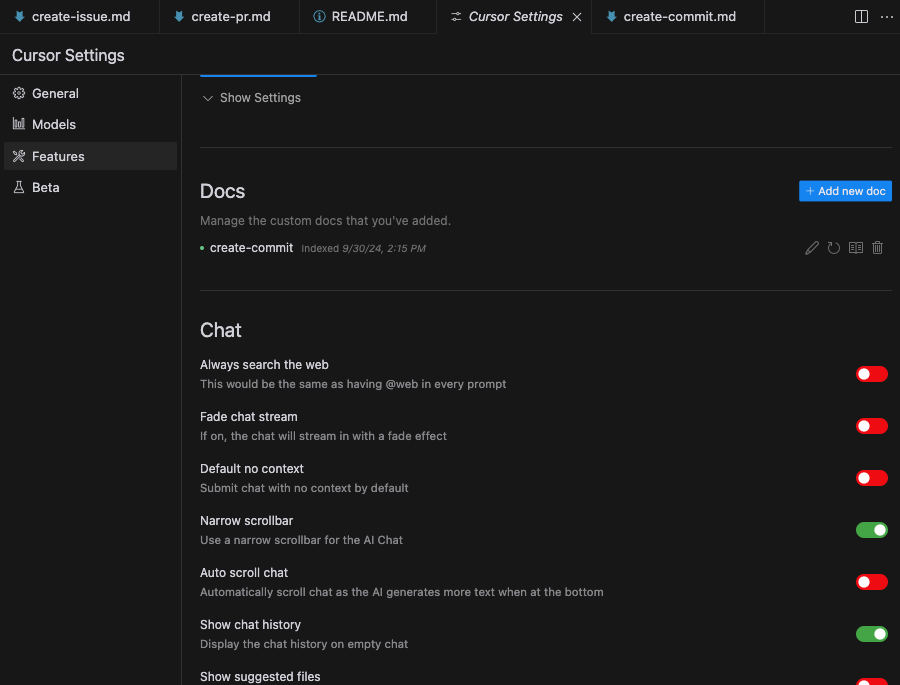

# Cursor AI Custom Commands

A collection of custom commands for enhancing productivity with Cursor AI. This repository contains carefully crafted prompts and system instructions for various development tasks.

## Overview

This repository serves as a centralized location for Cursor AI custom commands, making it easier to maintain and share commonly used development workflows.

## Installation

1. Open Cursor AI
2. Go to Settings -> Cursor Settings
3. Navigate to Features -> Docs
4. Click "+Add new doc"
5. Enter the path to the command markdown file from this repository (e.g., `https://github.com/jinho-kim-osd/cursor-commands/blob/main/commands/create-commit.md`)



## Commands

### Available Commands

- `@create-commit` - Generates standardized commit messages following Conventional Commits format([1](https://github.com/dgokcin/dotfiles/blob/main/ai-stuff/cursor/prompts/create-commit/system.md))

### Command Structure

Each command is stored in the `/commands` directory with the following structure:

### Usage

To use a command, simply type the command name (e.g., `@create-commit`) followed by any required input.

Example usage:

```git
@create-commit @Commit(Diff of Working State)
```

Note: The `@Commit(Diff of Working State)` tag automatically captures your current working changes when using the command.

### References

- [dgokcin/dotfiles](https://github.com/dgokcin/dotfiles/tree/main)
